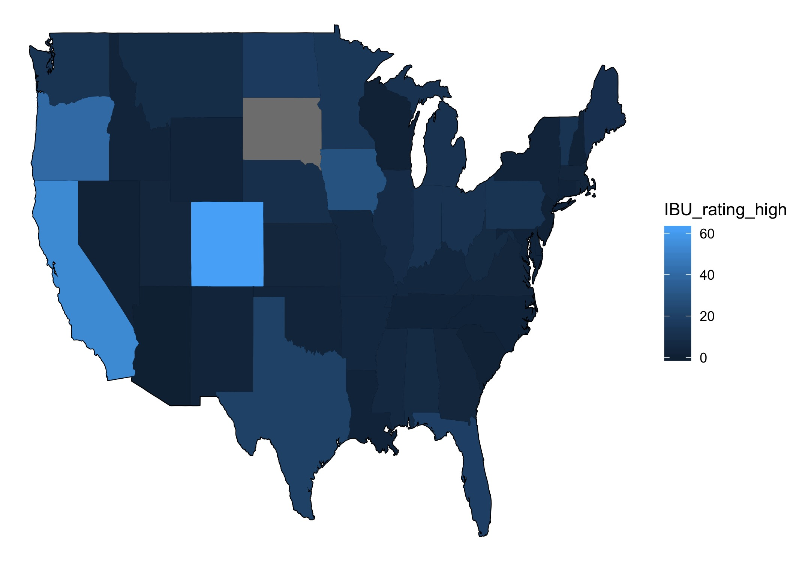
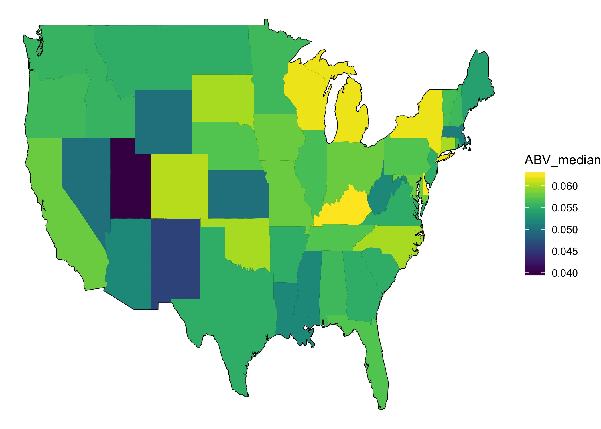
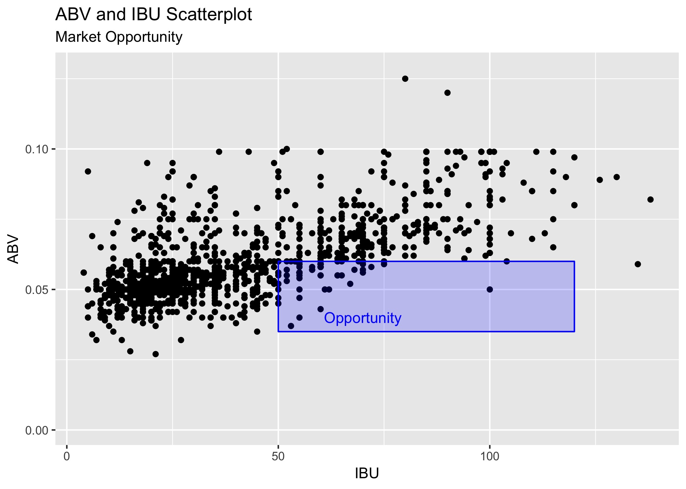

# Market Analysis for Anheuser-Busch
## This project is a simple market analysis of the breweries in the United States. The analysis was done on raw data consisting of two comma separated value data sets containing the name and addresses of breweries and the associated beers produced by each of these brewers. We analyzed the locations of brewers, beer styles, and geo-population-brewer relationships and generated a powerpoint presentation representing this analysis.This project produced some interesting results in alcohol content, bitterness, and population exposure for the crafted beer market.

[![R Version][R-image]][r-url]
[![Build Status][image]][travis-url]
[![Downloads Stats][github-downloads]][git-url]

### The application below imports the two comma seperated value files. We use R language to perform the following analysis:
    * Beer summarized by style
    * Percentage  of missing values in dataset
    * How many breweries in each state
    * Merge beer data with the breweries data. Print the first 6 observations and the last six observations to check the merged file.
    * Compute the median alcohol content and international bitterness unit for each state. Plot a bar chart to compare.
    * Top 10 states for having high IBU beers
    * Barplot of median IBU
    * Barplot of median ABV by state
    * Basic marker indication of market opportunity
    * State with maximum alcoholic (ABV) beer
    * State with maximum bitterness (IBU) beer


## Installation

OS X & MS Windows:

```{r}
case-study-1-analysis.Rmd
```

## Usage example

These are some examples of output:




## Development setup

To run this R application you will need to install the following libraries.

```{r}
install.packages(tidyverse)
install.packages(officer)
install.packages(magrittr)
#maps
install.packages(spData)
install.packages(mapdata)
install.packages(maps)
install.packages(stringr)
install.packages(viridis)
#Json parse
install.packages("httr")
install.packages("jsonlite")
#Table Grids
install.packages(grid)
install.packages(gridExtra)
```

## Codebook 
library(dataMaid)

The raw Data provided by Anheuser-Busch can be found in the `Data` directory.

2018 State population data was provided by the U.S. Census from the following API `https://api.census.gov/data/2018/pep/population?get=POP,GEONAME&for=state` 

The State area data was provided by Wikipedia `https://en.wikipedia.org/wiki/List_of_U.S._states_and_territories_by_area` 

The bulk of the analysis is represented in the `beer_brewery_byState` data.frame. This data has summarized by state. The codebook can be viewed in the [codebook_beer_brewery_byState.pdf]("./codebook_beer_brewery_byState.pdf"). 

## Release History

* 0.2.1
    * CHANGE: Update docs (module code remains unchanged)
* 0.2.0
    * CHANGE: Remove `setDefaultXYZ()`
    * ADD: Add `init()`
* 0.1.1
    * FIX: Crash when calling `baz()` (Thanks @GenerousContributorName!)
* 0.1.0
    * The first proper release
    * CHANGE: Rename `foo()` to `bar()`
* 0.0.1
    * Work in progress

## Meta

Mel Schwan – [@mobilewings](https://twitter.com/mobilewings) – mschwan@smu.edu

Distributed under the Holmes and Schwan license. See ``LICENSE`` for more information.

[https://github.com/bjholmes23/msds6306-case-study-1.git](https://github.com/bjholmes23/msds6306-case-study-1.git) Write for permissions

## Contributing

